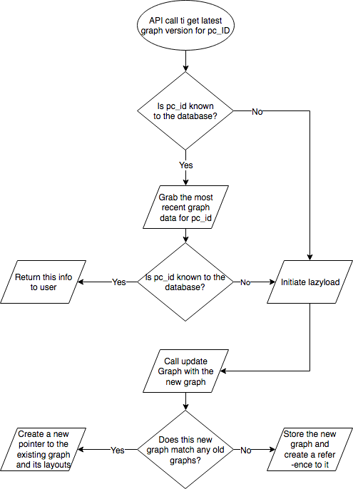

# app-ui


## Required software

- [Node.js](https://nodejs.org/en/) >=8.6.0


## Configuration

The following environment variables can be used to configure the server:

- `NODE_ENV` : the environment mode, either `production` or `development` (default)
- `PORT` : the port on which the server runs (default 3000)

### Configure RethinkDB
 1. Download [RethinkDB](https://www.rethinkdb.com/docs/install/)
 2. Start your RethinkDB server by following the steps [here](https://www.rethinkdb.com/docs/start-a-server/)
 3. Go to `src/server/database/config.js`  and modify the ip field to match your server address
 4. Start the project : `npm run start` or `npm run watch`, then the server will auto create all the required tables for you. 


## Run targets

- `npm start` : start the server
- `npm stop` : stop the server
- `npm run build` : build project
- `npm run build-prod` : build the project for production
- `npm run bundle-profile` : visualise the bundle dependencies
- `npm run clean` : clean the project
- `npm run watch` : watch mode (debug mode enabled, autorebuild, autoreload)
- `npm test` : run tests
- `npm run lint` : lint the project


## Running via Docker

Build the container.  Here, `app-ui` is used as the container name.

```
cd app-ui
docker build --build-arg "NODE_ENV=production" -t app-ui .
```

Run the container:

```
docker run -it -p 12345:3000 -u "node" -e "NODE_ENV=production" --name "app-ui" app-ui
```

Notes:

- The `-it` switches are necessary to make `node` respond to `ctrl+c` etc. in `docker`.
- The `-p` switch indicates that port 3000 on the container is mapped to port 12345 on the host.  Without this switch, the server is inaccessible.
- The `-u` switch is used so that a non-root user is used inside the container.
- The `-e` switch is used to set environment variables.  Alternatively use `--env-file` to use a file with the environment variables.
- References:
  - [Dockerizing a Node.js web app](https://nodejs.org/en/docs/guides/nodejs-docker-webapp/)
  - [Documentation of docker-node](https://github.com/nodejs/docker-node)
  - [Docker CLI docs](https://docs.docker.com/engine/reference/commandline/cli/)


## Testing

All files `/test` will be run by [Mocha](https://mochajs.org/).  You can `npm test` to run all tests, or you can run `mocha -g specific-test-name` (prerequisite: `npm install -g mocha`) to run specific tests.

[Chai](http://chaijs.com/) is included to make the tests easier to read and write.


## Publishing a release

1. Make sure the tests are passing: `npm test`
1. Make sure the linting is passing: `npm run lint`
1. Bump the version number with `npm version`, in accordance with [semver](http://semver.org/).  The `version` command in `npm` updates both `package.json` and git tags, but note that it uses a `v` prefix on the tags (e.g. `v1.2.3`).
  1. For a bug fix / patch release, run `npm version patch`.
  1. For a new feature release, run `npm version minor`.
  1. For a breaking API change, run `npm version major.`
  1. For a specific version number (e.g. 1.2.3), run `npm version 1.2.3`.
1. Push the release: `git push origin --tags`

## Shareable links
An untested but functional implementation of shareable links can be found on the shareable-links branch. If this feature is deemed desirable and is merged into master a cronjob should be set up on the server to handle purging of the snapshots after a 10 days. This can be done by:
1. opening the crontab to edit `crontab -e`.
1. adding the command `curl host:port/api/snapshot/purge` to the crontab.

## Pathway Commons Release Versioning

